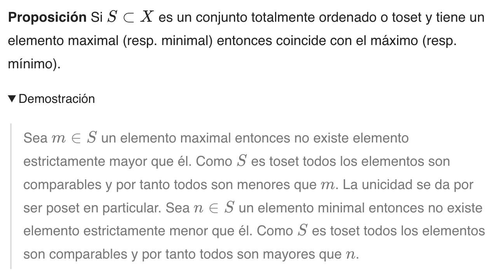

pelican-toggle: A Plugin for Pelican
====================================================

[](https://github.com/eigenric/pelican-toggle/actions)
[](https://pypi.org/project/pelican-toggle/)
[](https://pypi.org/project/pelican-toggle/)


Toggle text

Installation
------------

This plugin can be installed via:

    python -m pip install pelican-toggle

As long as you have not explicitly added a `PLUGINS` setting to your Pelican settings file, then the newly-installed plugin should be automatically detected and enabled. Otherwise, you must add `pelican_toggle` to your existing `PLUGINS` list. For more information, please see the [How to Use Plugins](https://docs.getpelican.com/en/latest/plugins.html#how-to-use-plugins) documentation.

Usage
-----

The `toggle` directive is used to create a disclosure widget. The directive has the following syntax:

```markdown
**Proposición** Si $S \subset X$ es un conjunto totalmente ordenado o toset y tiene un elemento maximal (resp. minimal) entonces coincide con el máximo (resp. mínimo).



Sea $m \in S$ un elemento maximal entonces no existe elemento estrictamente mayor que él. Como $S$ es toset todos los elementos son comparables y por tanto todos son menores que $m$. La unicidad se da por ser poset en particular.
Sea $n \in S$ un elemento minimal entonces no existe elemento estrictamente menor que él. Como $S$ es toset todos los elementos son comparables y por tanto todos son mayores que $n$.


````

And the output will be:




Contributing
------------

Contributions are welcome and much appreciated. Every little bit helps. You can contribute by improving the documentation, adding missing features, and fixing bugs. You can also help out by reviewing and commenting on [existing issues][https://github.com/getpelican/pelican/issues].

To start contributing to this plugin, review the [Contributing to Pelican][https://docs.getpelican.com/en/latest/contribute.html] documentation, beginning with the **Contributing Code** section.

[existing issues]: https://github.com/pelican-plugins/pelican-toggle/issues
[Contributing to Pelican]: https://docs.getpelican.com/en/latest/contribute.html

License
-------

This project is licensed under the MIT license.
